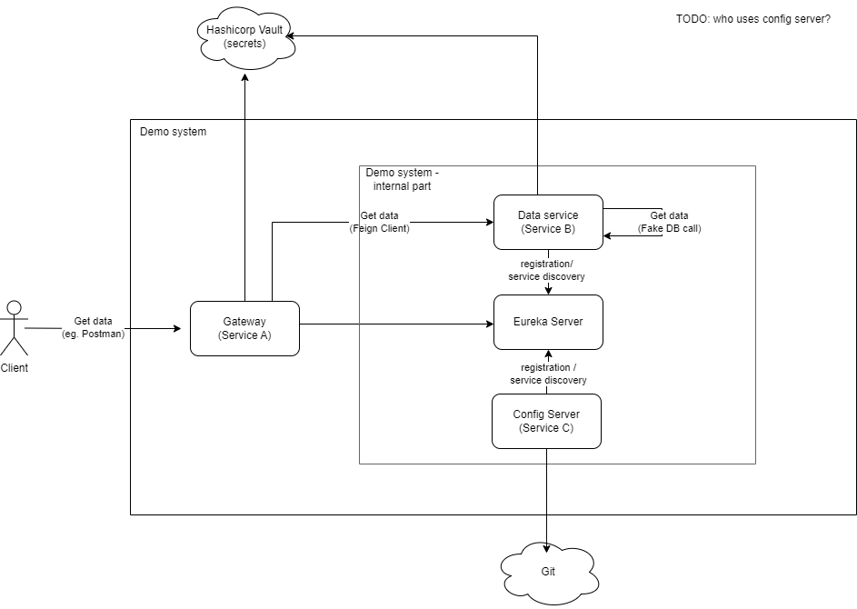

# instea-microservices-presentation
Demo for Microservice architecture Instea Tech Talk. Contains a demonstration of microservices architecture using Spring Cloud.

## How to run
- with docker compose:
```
docker-compose up --build
```


## Architecture
### Service A - API Gateway
Service A functions as an API Gateway, directing incoming requests to the appropriate backend services.
It's implemented using Spring the Cloud Gateway and integrates with Netflix Eureka for service discovery. Service A also fetches its configuration from Service C - Config Server, enabling centralized management of its routing rules and other configurations.

#### Key Responsibilities:
- **Request Routing**: Direct requests to backend services based on routing rules.
- **Fault Tolerance**: Using Feign clients integrated with Resilience4j for robustness.
- **Security**: Basic HTTP authentication to secure endpoints.
- **Configuration Management**: Fetch and update configuration properties dynamically from Service C - Config Server.

### Service B - Backend Service
Service B is responsible for processing data and providing business logic. It registers with Eureka and can be dynamically discovered by Service A. Similar to Service A, Service B retrieves its configuration from Service C - Config Key Server, ensuring that its behavior is consistent with the latest configurations stored centrally.

#### Key Responsibilities:
- **Data Processing**: Handle and respond to requests forwarded by Service A.
- **Service Registration**: Automatically registers with Eureka server for discovery.
- **Configuration Management**: Retrieve and manage configuration settings dynamically from Service C - Config Server.

### Service C - Config Server
Service C acts as a Spring Cloud Config Server, managing externalized configuration properties for services A and B. This service centralizes and version-controls configurations, typically fetching them from a source control system like Git.

#### Key Responsibilities:
- **Central Configuration Management**: Store and serve configuration properties for microservices.
- **Version Control Integration**: Integrate with Git to manage configuration versions and history.
- **Dynamic Update Capability**: Allow services to refresh their configurations without restarting, supporting dynamic changes in the environment.

### Eureka Server
A service registry that provides discovery services for microservices. All services register with Eureka and discover each other via this centralized registry, enabling load balancing and failover of inter-service calls.

#### Key Responsibilities:
- **Service Registration and Discovery**: Allow services to register themselves and discover other services dynamically.

### Vault
Manages sensitive data such as passwords, tokens, and API keys using static and dynamic secrets management. Services A and B interact with Vault to retrieve secrets required for their operations.

#### Key Responsibilities:
- **Secrets Management**: Securely store, access, and manage secrets.
- **Dynamic Secrets**: Provide capabilities for on-the-fly generation of credentials, reducing the risks associated with static credentials.

### Architecture diagram

(source: **architecture.drawio**)

This architecture is not production ready, it is **basic** for educational purposes, in reality are these differences:
- more microservices
- real external systems (eg. real DB)
- microservices often communicate via events
- (auto)scaling concept should be present

## Concepts covered
- **API Gateway**: Utilizing Spring Cloud Gateway for routing to various services.
- **Service Discovery**: Integration of Netflix Eureka for dynamic service discovery.
- **Authentication and Authorization**: Basic auth to secure endpoints.
- **Client Resilience**: Implementation of Feign clients with Resilience4j for fault tolerance.
- **Configuration Management**: Centralized configuration via Spring Cloud Config.
- **Secret Management**: Secure management of secrets using Spring Cloud Vault.
- **Observability**: Tracing with Jaeger, metrics with Spring Boot Actuator, and enhanced logging and audit capabilities.

## Advised route
This is recomended learning route to browse this demo.

1. xxx
