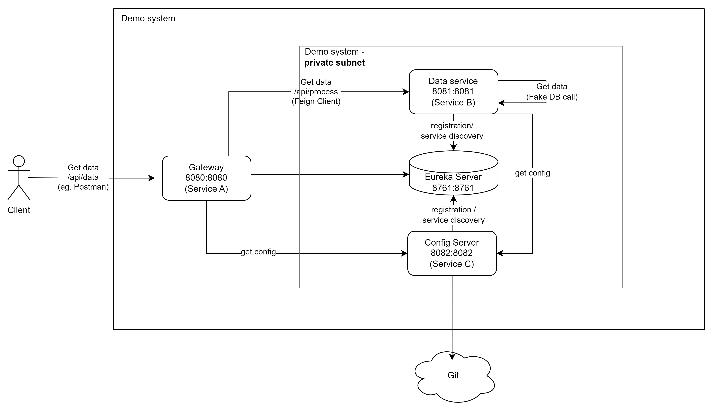

# instea-microservices-presentation
Demo for Microservice architecture Instea Tech Talk. Contains a demonstration of microservices architecture using Spring Cloud.

## How to run
1. start Eureka
2. start Config Server (Eureka does not use CS, order does not matter)
3. start service B
4. start service A

## Architecture
### Service A - API Gateway
Service A functions as an API Gateway, directing incoming requests to the appropriate backend services.
It's implemented using Spring the Cloud Gateway and integrates with Netflix Eureka for service discovery. Service A also fetches its configuration from Service C - Config Server, enabling centralized management of its routing rules and other configurations.

#### Key Responsibilities:
- **Request Routing**: Direct requests to backend services based on routing rules.
- **Fault Tolerance**: Using Feign clients integrated with Resilience4j for robustness.
- **Security**: Basic HTTP authentication to secure endpoints.
- **Configuration Management**: Fetch and update configuration properties dynamically from Service C - Config Server.


### Service B - Backend Service
Service B is responsible for processing data and providing business logic. It registers with Eureka and can be dynamically discovered by Service A. Similar to Service A, Service B retrieves its configuration from Service C - Config Key Server, ensuring that its behavior is consistent with the latest configurations stored centrally.

#### Key Responsibilities:
- **Data Processing**: Handle and respond to requests forwarded by Service A.
- **Service Registration**: Automatically registers with Eureka server for discovery.
- **Configuration Management**: Retrieve and manage configuration settings dynamically from Service C - Config Server.

### Service C - Config Server
Service C acts as a Spring Cloud Config Server, managing externalized configuration properties for services A and B. This service centralizes and version-controls configurations, typically fetching them from a source control system like Git.

#### Key Responsibilities:
- **Central Configuration Management**: Store and serve configuration properties for microservices.
- **Version Control Integration**: Integrate with Git to manage configuration versions and history.
- **Dynamic Update Capability**: Allow services to refresh their configurations without restarting, supporting dynamic changes in the environment.

### Service D - Eureka Server
A service registry that provides discovery services for microservices. All services register with Eureka and discover each other via this centralized registry, enabling load balancing and failover of inter-service calls.

#### Key Responsibilities:
- **Service Registration and Discovery**: Allow services to register themselves and discover other services dynamically.

### Architecture diagram

(source: **architecture.drawio**)

This architecture is not production ready, it is **basic** for educational purposes, in reality are these differences:
- more microservices
- real external systems (eg. real DB)
- microservices often communicate via events
- (auto)scaling concept should be present
- configuration should be in external repo (not in repo with code) - should have different authorization
- auth is not configured
  - integration with Spring API Gateway is possible (filters): eg. spring-security + TokenValidationFilter + spring.cloud.gateway.routes[x].filters[y]
- secret management is not present
  - eg. spring-cloud-starter-vault-config + Hashicorp Vault
  - useful eg. for database passwords
- tracing is not configured
  - eg. Jaeger
  - jaeger arch:  https://www.jaegertracing.io/docs/1.57/architecture/
  - uber-trace-id: https://www.jaegertracing.io/docs/1.22/client-libraries/#key
- log scraping is not configured
  - eg. ELK stack 
  - possible flow
    1. Store logs in logstash format (logstash-logback-encoder + logback.xml)
    2. Configure logstash to scrape logs from microservices and send them to Elastic
    3. Visualize logs in Kibana

## Concepts covered
- **API Gateway**: Utilizing Spring Cloud Gateway for routing to various services.
- **Service Discovery**: Integration of Netflix Eureka for dynamic service discovery.
- **Client Resilience**: Implementation of Feign clients with Resilience4j for fault tolerance.
- **Configuration Management**: Centralized configuration via Spring Cloud Config.
- **Observability**: Management endpoints with Spring Boot Actuator.

## Advised route
This is recomended learning route to browse this demo.

1. Architecture diagram
2. Service B (target service, express that "goal" is to invoke /process endpoint - but service(s) is(are) in private subnet)
3. Service A (gateway to target service)
4. Service C (contains configuration to target service)

## Circuit breaker example
GET http://localhost:8080/actuator/health

```
...
{
  # Percentage of calls that failed compared to the total number of calls within a given window
  # -1.0% = no failure calls have been made
  "failureRate": "-1.0%",
  # If the `failureRate` exceeds `failureRateThreshold`, the circuit breaker will OPEN (prevent calls).
  "failureRateThreshold": "50.0%",
  # Percentage of calls that are considered slow, based on predefined thresholds of call duration. 
  # -1.0% = no calls have been slow
  "slowCallRate": "-1.0%",
  # # If the `slowCallRate` exceeds `slowCallRateThreshold`, the circuit breaker will OPEN (prevent calls).
  "slowCallRateThreshold": "100.0%",
  # The total number of calls in the current measurement window. 
  "bufferedCalls": 0,
  # Number of slow calls (slow call is defined by slowCallDurationThreshold)
  "slowCalls": 0,
  # Number of slow calls that failed
  "slowFailedCalls": 0,
  # Number of failed calls
  "failedCalls": 0,
  # Number of calls that was not permitted by the circuit breaker (due to OPEN or HALF-OPEN state)
  "notPermittedCalls": 0,
  # CLOSED/OPEN/HALF-OPEN/DISABLED/FORCE-OPEN
  "state": "CLOSED"
}
```